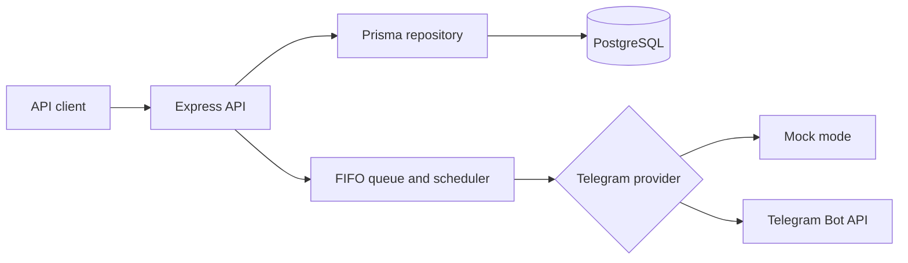

# Telegram Mailing Service

Самостоятельный API-сервис для создания и управления Telegram-рассылками. Сервис хранит рассылки и статусы доставки в PostgreSQL, поддерживает отложенный запуск, FIFO-очередь, повторные попытки и тестовую отправку одному получателю.

## Возможности

- REST API для создания, запуска, планирования, отмены и просмотра рассылок;
- Swagger UI на `/docs` и OpenAPI-документ в `/docs.json`;
- PostgreSQL через Prisma ORM и миграции;
- прямой вызов Telegram Bot API без внешней CMS или оркестратора;
- `mock`-режим для локального запуска без токена бота;
- ограничение частоты запросов, Helmet, CORS и опциональный `X-API-Key`;
- Docker Compose с PostgreSQL, healthcheck и непривилегированным пользователем.

## Архитектура

Проект построен как модульный монолит: HTTP-слой принимает команды, репозиторий работает с Prisma, очередь отвечает за планирование и последовательную обработку, а Telegram-провайдер изолирует внешнюю интеграцию.



## Запуск через Docker

Требования: Docker Engine и Docker Compose v2.

Для безопасного локального демо токен не нужен:

```bash
docker compose up --build
```

После запуска:

- Swagger UI: <http://localhost:4444/docs>;
- healthcheck: <http://localhost:4444/health>;
- API: <http://localhost:4444/api>.

Для live-режима создайте `.env.local` на основе `.env.example`, задайте `TELEGRAM_MODE=live` и `TELEGRAM_BOT_TOKEN`, затем запустите Compose. Если задаёте `API_KEY`, передавайте его в заголовке `X-API-Key`.

Остановка сервисов:

```bash
docker compose down
```

Для удаления локального тома PostgreSQL:

```bash
docker compose down -v
```

## Локальный запуск

```bash
cp .env.example .env.local
npm ci
npm run db:generate
npm run db:deploy
npm run build
npm start
```

Для разработки:

```bash
npm run dev
```

Локальный запуск требует доступный PostgreSQL и корректный `DATABASE_URL`. По умолчанию `TELEGRAM_MODE=mock`, поэтому API можно проверять без внешних запросов к Telegram.

## Пример API

Создание текстовой рассылки:

```bash
curl -X POST http://localhost:4444/api/mailings \
  -H 'Content-Type: application/json' \
  -d '{
    "title": "Демо-рассылка",
    "text": "Сообщение для подписчиков",
    "type": "text",
    "buttons": [{"text": "Открыть сайт", "url": "https://example.com"}],
    "recipients": [{"telegramId": "123456789", "username": "demo_user"}]
  }'
```

Запуск рассылки с ID `1`:

```bash
curl -X POST http://localhost:4444/api/mailings/1/start
```

Отправка тестового сообщения:

```bash
curl -X POST http://localhost:4444/api/mailings/1/test \
  -H 'Content-Type: application/json' \
  -d '{"telegramId":"123456789"}'
```

В live-режиме Telegram-бот должен иметь возможность написать получателю. Telegram ID хранится как `BigInt`, поэтому в API передаётся строкой и не теряет точность.

## Переменные окружения

| Переменная | Назначение |
| --- | --- |
| `DATABASE_URL` | строка подключения PostgreSQL |
| `TELEGRAM_MODE` | `mock` или `live`, по умолчанию `mock` |
| `TELEGRAM_BOT_TOKEN` | токен Telegram-бота, нужен только в `live` |
| `TELEGRAM_API_URL` | адрес Telegram API, по умолчанию официальный endpoint |
| `API_KEY` | необязательный ключ для `X-API-Key` |
| `QUEUE_DELAY_MS` | задержка между получателями |
| `QUEUE_MAX_RETRIES` | число попыток отправки |
| `QUEUE_RETRY_DELAY_MS` | задержка между попытками |
| `CORS_ORIGINS` | список разрешённых origin через запятую |

## Структура проекта

Команда для просмотра дерева:

```bash
tree -L 3
```

Основные пути:

```bash
src/app.ts # Express-приложение, healthcheck и Swagger
src/api.ts # REST-маршруты
src/services/mailingQueue.ts # FIFO-очередь, планировщик и retry
src/services/telegramProvider.ts # live/mock Telegram-провайдер
src/repositories/mailingRepository.ts # Prisma-запросы
prisma/schema.prisma # модель данных
prisma/migrations # миграции PostgreSQL
```

## Проверки

```bash
npm run typecheck
npm run build
npm test
npm audit
```

## Скриншоты


## Лицензия

Исходный код распространяется по ограничительной лицензии из `LICENSE`. Зависимости и Telegram API регулируются собственными условиями правообладателей.
